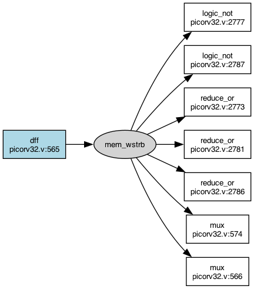

# picorv32-depgraph

A small script that builds a dependency graph of a Verilog chip design and answers one question:
if I change this signal, what else can it affect?

I am teaching myself chip design by reading [PicoRV32](https://github.com/YosysHQ/picorv32), a RISC-V
core in one file. Tracing signals by hand through 3,000 lines of Verilog got old, so I built this.
One Python file, 218 lines, no dependencies. Yosys does the real work.

## What we built

A chip is registers with logic in between, and on every clock edge each register takes whatever the
logic worked out from the previous values. So the design is a graph, and "what does this affect" is a
walk forward through it. Yosys reads the Verilog and writes a JSON netlist where every wire bit has a
number and every cell carries the source line it came from. The script loads that and walks it.

```
yosys -q -p "read_verilog picorv32.v; hierarchy -top picorv32_axi; proc; flatten; opt_clean; write_json picorv32.json"
```

```
$ python3 depgraph.py picorv32.json stats
top module: picorv32_axi
named signals: 240
cells: 919 (117 registers, 802 combinational)
chip outputs: 19
```

Ask what reads a signal:

```
$ python3 depgraph.py picorv32.json readers cpu_state
picorv32_core.cpu_state (8 bits, declared at picorv32.v:1181) is read by 109 cell(s):
  logic $eq at picorv32.v:1313
      A    <- picorv32_core.cpu_state
      B    <- constant 64
      Y    -> 1 unnamed wire
  ... and 108 more
```

That one taught me something. The script knows nothing about PicoRV32, but comparing `cpu_state`
against 64 is the CPU's state machine: `cpu_state_fetch` is `8'b01000000`, which is 64, and line 1313
turns out to be `if (cpu_state == cpu_state_fetch)`. The graph found the state machine by itself and
pointed at the exact line.

And the whole downstream cone:

```
$ python3 depgraph.py picorv32.json impact reg_pc
picorv32_core.reg_pc (32 bits, declared at picorv32.v:176)
  same clock cycle: 25 cells, landing in 6 registers
  across clock cycles: 893 of 919 cells
  chip outputs it can affect: 15 of 19 (trap, mem_axi_awvalid, mem_axi_awaddr, ...)
```

Two numbers because there are two questions. Stop at the registers and you get what moves in this same
clock tick. Walk through them and you get what can move eventually, over many ticks.

It also goes backwards (`drivers`) and compares two versions of a design (`diff`). And it draws:

```
python3 depgraph.py picorv32.json dot mem_wstrb | dot -Tpng -o mem_wstrb.png
```



One register at `picorv32.v:565` drives `mem_wstrb`, which fans out to seven cells. Blue is a register,
white is combinational logic, and every box carries the line it came from.

## Does it actually work?

A graph that says "this signal can affect that one" is a claim, and I wanted it checked by something
that is not me. PicoRV32 ships five deliberately broken versions of itself behind `ifdef`s, put there so
you can test whether a testbench catches them. Two of them corrupt the register file:

```verilog
`ifdef PICORV32_TESTBUG_001
        cpuregs[latched_rd ^ 1] <= cpuregs_wrdata;   // writes to the wrong register
`elsif PICORV32_TESTBUG_002
        cpuregs[latched_rd] <= cpuregs_wrdata ^ 1;   // writes the wrong value
```

So: simulate the design twice, once clean and once with the bug, dump both waveforms, and compare. Any
signal whose trace differs really was affected by those lines. Then check that against what the graph
predicted. If a signal really changed and the graph did not predict it, the graph is wrong.

```
$ python3 depgraph.py core.json verify clean.vcd bug1.vcd --line 1339,1340
graph predicts 0 signals can be affected
waveforms: 275 signals dumped, 118 changed, 76 of those are design signals the graph knows
changed but not predicted: 76

UNSOUND: the graph missed 76 signals the design drives.
```

The first run failed completely, and finding out why was the most useful thing in this project.
Everything in a netlist is joined by wires except memories. Yosys turns the register file into a write
cell and two read cells that find each other through a `MEMID` parameter, with no wire between them, so
the walk hit the register file and stopped dead. I gave each memory one invented wire that the write
drives and the reads depend on, which is nine lines in `load()`. Same test again:

```
$ python3 depgraph.py core.json verify clean.vcd bug1.vcd --line 1339,1340
graph predicts 136 signals can be affected
waveforms: 275 signals dumped, 118 changed, 76 of those are design signals the graph knows
changed but not predicted: 4
  dbg_mem_rdata  (an input, driven by the testbench, not by the design)
  dbg_mem_ready  (an input, driven by the testbench, not by the design)
  mem_rdata  (an input, driven by the testbench, not by the design)
  mem_ready  (an input, driven by the testbench, not by the design)

SOUND: every signal the design itself drives was predicted.
```

Both injected bugs now pass. The four signals it does not predict are the right four: `mem_rdata` and
`mem_ready` are inputs to the core, and `dbg_mem_rdata` and `dbg_mem_ready` are aliases of them
(`wire dbg_mem_ready = mem_ready;`). The bug changed which addresses the CPU asked for, so the testbench
answered differently. That loop closes outside the core, and no graph of the core alone can see it.

Reproduce it:

```
iverilog -o clean.vvp testbench_ez.v picorv32.v && vvp -N clean.vvp +vcd && mv testbench.vcd clean.vcd
iverilog -DPICORV32_TESTBUG_001 -o bug1.vvp testbench_ez.v picorv32.v && vvp -N bug1.vvp +vcd && mv testbench.vcd bug1.vcd
yosys -q -p "read_verilog picorv32.v; hierarchy -top picorv32; proc; flatten; opt_clean; write_json core.json"
python3 depgraph.py core.json verify clean.vcd bug1.vcd --line 1339,1340
```

Top is `picorv32` here, not `picorv32_axi`, because that is what the testbench instantiates.

## Why it matters

Knowledge about a design does not survive the design changing.

`diff` compares two versions by signal name, and on a real PicoRV32 commit (`6d145b7`) that renamed one
signal and changed no logic at all:

```
same name: 190   gone: 1   new: 1
  - decoded_imm_uj
  + decoded_imm_j
```

By name it looks like something was deleted and something else appeared. Everything I know about the old
signal, every test that covered it, looks invalid, and none of that is true. I do not have a fix in the
script. Working out what "the same signal" means across two versions of a design seems to be the actual
hard part, and it is the thing I would most like to work on next.

## Printing it as .tapeout

[Tapeout Labs](https://tapeoutlabs.com) publish a flat text format for hardware facts called
[tof](https://github.com/tapeout-labs/tof): one fact per line, and every line carries the source it came
from. I liked the idea enough to make the impact result print that way, which was about six lines of code:

```
$ python3 depgraph.py picorv32.json impact decoded_imm --tapeout
tapeout 1
ip picorv32 top picorv32_axi
finding IMPACT-001 confirmed info "decoded_imm reaches 15 of 19 chip outputs" desc "same cycle 19 cells into 4 registers; eventually 893 of 919 cells" @ picorv32.v:657
```

It says `confirmed` because every number in it was computed by walking the netlist, not guessed.

## Run it

```
brew install yosys
git clone https://github.com/YosysHQ/picorv32
yosys -q -p "read_verilog picorv32/picorv32.v; hierarchy -top picorv32_axi; proc; flatten; opt_clean; write_json picorv32.json"
python3 depgraph.py picorv32.json stats
```

Python 3, nothing to install. Yosys 0.69 and Icarus Verilog 13.0 on macOS. Graphviz for pictures.

Limits worth knowing: Verilog only, one configuration at a time (`ENABLE_IRQ` defaults to 0, so the
interrupt logic is not in the graph at all), cells are Yosys operators after `proc` rather than gates,
and `diff` compares by name for the reason above. [NOTES.md](NOTES.md) is what I wrote down while
reading the core, including one thing I got wrong.
